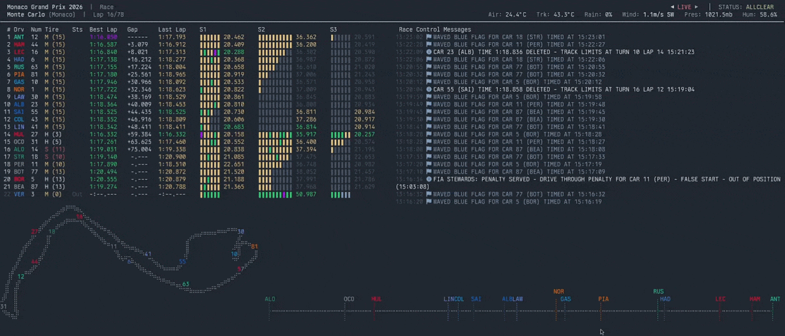

# f1-term



<video src="https://raw.githubusercontent.com/kikefdezl/f1-term/main/assets/f1-term.mp4" controls width="100%"></video>

A terminal user interface for Formula 1 telemetry and live timing.

## Overview

`f1-term` is a TUI application built in Rust. It connects to official live F1
telemetry streams to display real-time data directly in your terminal.

**NOTE**: `f1-term` is still in early development and might have some bugs.

## Requirements

- Rust
- Cargo

## Usage

### Live Telemetry

To automatically stream the latest live telemetry:

```sh
cargo run --release
```

### Replay Mode

If you want to stream an older event, first select a replay:

```sh
cargo run --release -p f1-term-replay

```

Then run the application against the local replay server (`localhost:5000`):

```sh
cargo run -- --replay
```

## Development

The project is structured as a Cargo workspace containing the following core components:

- `f1-term-core`: Data structures and telemetry engine
- `f1-term-tui`: Terminal user interface powered by ratatui
- `f1-term-signalr`: SignalR client for real-time F1 data
- `f1-term-multiviewer`: Client for Multiviewer API integration
- `f1-term-replay`: Replay functionality

The project uses `just` as a command runner. Common development commands include:

- `just run`: Run the application
- `just format`: Format the codebase (requires a nightly toolchain)
- `just lint`: Run clippy
- `just test`: Run the workspace test suite
